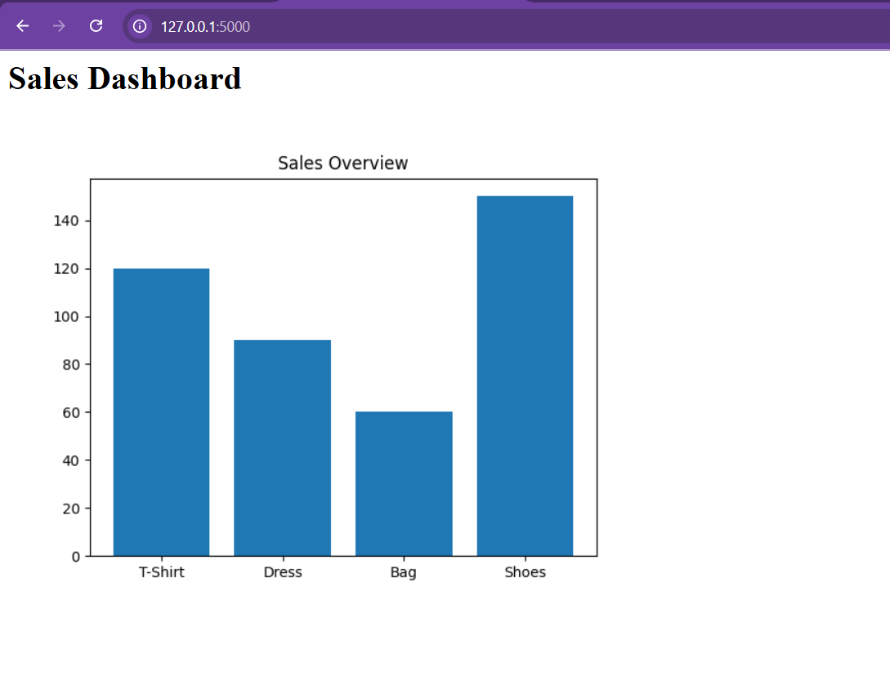

# Sales Analytics Dashboard

A Python Flask dashboard for visualizing product sales performance.

## Features
- Product sales visualization
- Bar chart with Matplotlib
- Flask web interface
- Sales performance overview

## Technologies
- Python
- Flask
- Matplotlib
- HTML

## Screenshot

## Business Value
This project helps analyze product performance and identify best-selling products through a simple visual dashboard.

## Future Improvements
- CSV data upload
- Monthly sales filtering
- Revenue calculations
- Improved UI design
